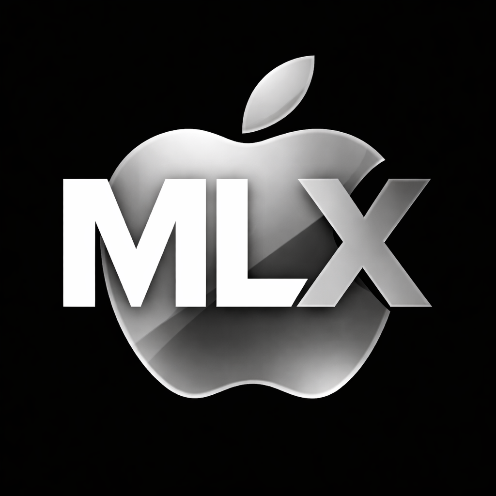

<p align="center">
  
</p>

<h1 align="center">Apple MLX Tutorials</h1>

<p align="center">
  Apple Silicon에서 MLX Swift 프레임워크를 배우는 튜토리얼 앱
</p>

## 요구사항

- macOS 14.0+
- Apple Silicon (M1/M2/M3/M4)

## 설치

[Releases](https://github.com/crossplatformkorea/AppleMLXTutorials/releases)에서 DMG 파일을 다운로드하세요.

## 튜토리얼 목차

| 기본 | 신경망 | 고급 |
|------|--------|------|
| 1. MLX 소개 | 6. 신경망 기초 | 11. LLM 텍스트 생성 |
| 2. 배열 기초 | 7. 활성화 & 손실 함수 | 12. VLM 이미지 분석 |
| 3. 배열 연산 | 8. 옵티마이저 | 13. LoRA 파인튜닝 |
| 4. 디바이스 관리 | 9. 모델 저장/로드 | 14. 이미지 생성 |
| 5. 자동 미분 | 10. MNIST 분류기 | 15. 생태계 |

## 개발

```bash
brew install xcodegen
xcodegen generate
open AppleMLXTutorials.xcodeproj
```

## 링크

- [MLX Swift](https://github.com/ml-explore/mlx-swift)
- [MLX Swift Examples](https://github.com/ml-explore/mlx-swift-examples)

---

Made with love by [Cross Platform Korea](https://www.youtube.com/@crossplatformkorea)
